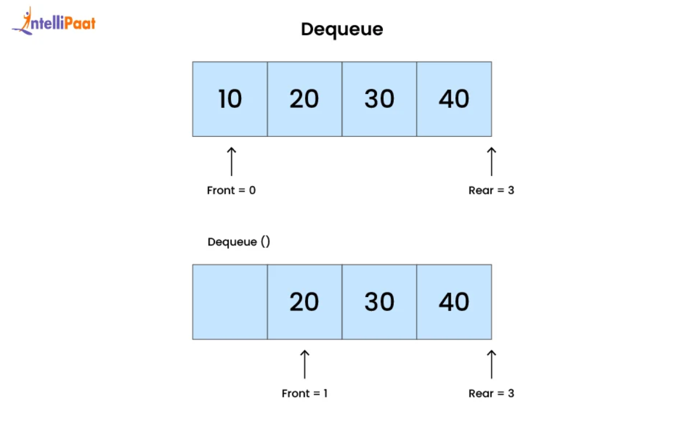
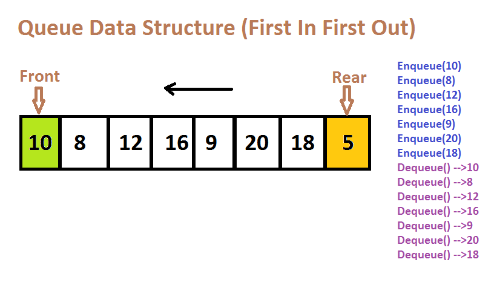

# 📚 Queue using Array in C  

  
  

---

## 📖 What is a Queue?  

A **Queue** is a **linear data structure** that follows the principle of **FIFO (First In, First Out)**.  

- Insertion happens at the **rear**.  
- Deletion happens from the **front**.  
- Think of it like a line of people waiting for tickets 🎟️ — the person who comes **first** gets served **first**.  

👉 Example:  
If we enqueue elements `10, 20, 30`, then the first element to be dequeued will be `10`.  

---

## 🔹 Queue Operations  

1. **Enqueue** → Insert an element at the rear.  
2. **Dequeue** → Remove an element from the front.  
3. **Peek** → Get the front element without removing it.  
4. **isEmpty** → Check if the queue is empty.  
5. **isFull** → Check if the queue is full.  

---

## 🔧 Queue Initialization  

Before using a queue, we must **initialize it**.  
In our program, we use the `init()` function:  

```c
void init(struct Queue *q) {
    q->rear = -1;
}
```

### Explanation:  
- `rear = -1` → means the queue is **empty** (no elements yet).  
- We don’t need a separate `front` pointer here, since we always remove from index `0` by shifting elements.  
- After initialization, any `enqueue()` will start inserting from index `0`.  

👉 Example:  

```
Queue Initialized → [ ][ ][ ][ ][ ]  
rear = -1 (empty queue)
```

After `enqueue(&q, 10);`  

```
Queue → [10][ ][ ][ ][ ]  
rear = 0
```

---

## 🧮 Memory Representation  

When we implement a queue using an array:  

- Rear (`rear`) keeps track of the **last inserted element**.  
- Elements are stored in `arr[MAX]`.  
- On dequeue, elements are shifted one step to maintain order.  

| Operation  | Queue State (front → rear) |
|------------|-----------------------------|
| Enqueue 10 | 10 |
| Enqueue 20 | 10 20 |
| Enqueue 30 | 10 20 30 |
| Dequeue    | 20 30 |

---

## 🖼️ Visual Representation  

### 📌 Queue as a Line  
  

### 📌 Queue Memory Layout  
  

---

## 🚀 Code Implementation  

```c
#include <stdio.h>
#include <stdlib.h>

#define MAX 5

struct Queue {
    int arr[MAX];
    int rear;
};

// Initialize Queue
void init(struct Queue *q) {
    q->rear = -1;
}

// Check if queue is empty
int isEmpty(struct Queue *q) {
    return q->rear == -1;
}

// Check if queue is full
int isFull(struct Queue *q) {
    return q->rear == MAX - 1;
}

// Enqueue operation
void enqueue(struct Queue *q, int data) {
    if (isFull(q)) {
        printf("Queue Overflow\n");
        return;
    }
    q->arr[++q->rear] = data;
}

// Dequeue operation
int dequeue(struct Queue *q) {
    if (isEmpty(q)) {
        printf("Queue Underflow\n");
        return -1;
    }
    int front = q->arr[0];
    for (int i = 0; i < q->rear; i++) {
        q->arr[i] = q->arr[i + 1]; // shifting
    }
    q->rear--;
    return front;
}

// Peek operation
int peek(struct Queue *q) {
    if (isEmpty(q)) {
        printf("Queue is Empty\n");
        return -1;
    }
    return q->arr[0];
}

// Driver Code
int main() {
    struct Queue q;
    init(&q);

    enqueue(&q, 10);
    enqueue(&q, 20);
    enqueue(&q, 30);
    enqueue(&q, 40);
    enqueue(&q, 50);

    while (!isEmpty(&q)) {
        printf("%d\n", peek(&q));
        dequeue(&q);
    }

    return 0;
}

```

---

## 🎯 Output  

```
Enter number of elements (max 5): 4
Enter 4 elements:
10 20 30 40
Queue elements are:
10 20 30 40
```

---

## ✨ Key Points  

- Queue works on **FIFO principle**.  
- `enqueue()` inserts elements at the **rear**.  
- `dequeue()` removes elements from the **front**.  
- Simple queue using array may cause **shifting of elements** on deletion → not efficient.  
- For better performance, a **Circular Queue** is preferred.  

---

## 📚 References  
- [GeeksforGeeks: Queue in C](https://www.geeksforgeeks.org/queue-set-1introduction-and-array-implementation/)  
- [TutorialsPoint: C Queue](https://www.tutorialspoint.com/data_structures_algorithms/dsa_queue.htm)  

---

✨ *Made with ❤️ by Subhrajeet Bhoi*
