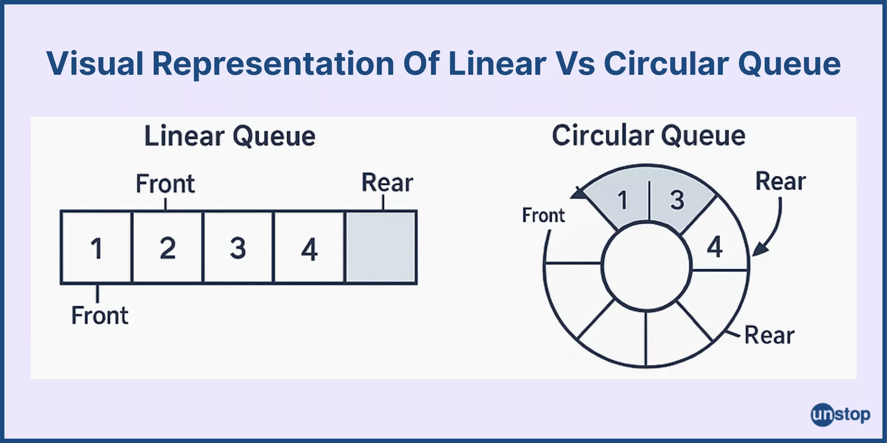
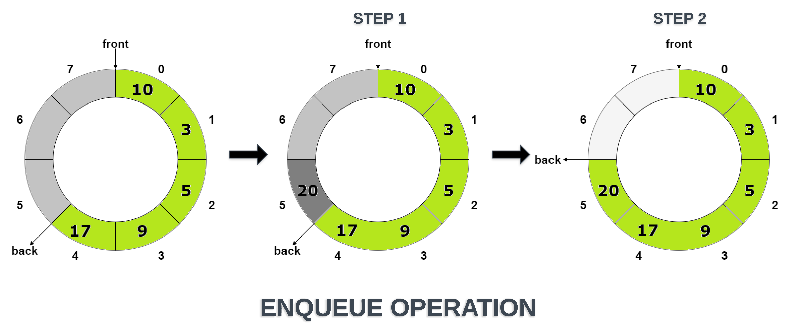

# 🔄 Circular Queue using Array in C  

  
  

---

## 📖 What is a Circular Queue?  

A **Circular Queue** is an advanced form of a simple queue in which:  

- The **last position** is connected back to the **first position**.  
- It solves the problem of wasted space in a **linear queue**.  
- The queue works on the principle of **FIFO (First In, First Out)**.  

👉 Example:  
If we enqueue `10, 20, 30, 40, 50` in a queue of size `5` and then dequeue two elements, we can still insert new elements at the freed spaces — because of the circular arrangement.  

---

## 🔹 Queue Operations  

1. **Enqueue** → Insert an element at the rear.  
2. **Dequeue** → Remove an element from the front.  
3. **Peek** → Get the front element without removing it.  
4. **isEmpty** → Check if the queue is empty.  
5. **isFull** → Check if the queue is full.  

---

## 🧮 Memory Representation  

In a circular queue:  

- `front` → points to the **first element**.  
- `rear` → points to the **last inserted element**.  
- `(rear + 1) % SIZE == front` → means the queue is **full**.  

| Operation       | Queue State (front → rear) |
|-----------------|-----------------------------|
| Enqueue 10      | 10 |
| Enqueue 20      | 10 20 |
| Enqueue 30      | 10 20 30 |
| Dequeue         | 20 30 |
| Enqueue 40, 50  | 20 30 40 50 |
| Enqueue 60      | 60 30 40 50 (wrapped around) |

---

## 🖼️ Visual Representation  

### 📌 Linear Queue Vs Circular Queue
  

### 📌 Queue Memory Layout  
  

---

## 🚀 Code Implementation  

```c
#include <stdio.h>
#include <stdlib.h>

#define SIZE 5  // Maximum size of the circular queue

typedef struct {
    int arr[SIZE];
    int front, rear;
} CircularQueue;

// Initialize the queue
void initQueue(CircularQueue *q) {
    q->front = -1;
    q->rear = -1;
    for (int i = 0; i < SIZE; i++) {
        q->arr[i] = -1;  // -1 indicates empty slot
    }
}

// Check if the queue is empty
int isEmpty(CircularQueue *q) {
    return (q->front == -1);
}

// Check if the queue is full
int isFull(CircularQueue *q) {
    return ((q->rear + 1) % SIZE == q->front);
}

// Enqueue operation
void enqueue(CircularQueue *q, int value) {
    if (isFull(q)) {
        printf("Queue is FULL! Cannot insert %d\n", value);
        return;
    }
    if (q->front == -1)  // First insertion
        q->front = 0;
    q->rear = (q->rear + 1) % SIZE;
    q->arr[q->rear] = value;
    printf("%d inserted\n", value);
}

// Dequeue operation
int dequeue(CircularQueue *q) {
    if (isEmpty(q)) {
        printf("Queue is EMPTY!\n");
        return -1;
    }
    int data = q->arr[q->front];
    q->arr[q->front] = -1;  // Mark slot as empty
    if (q->front == q->rear) {
        // Queue becomes empty
        q->front = q->rear = -1;
    } else {
        q->front = (q->front + 1) % SIZE;
    }
    return data;
}

// Display the current state of the array
void displayArray(CircularQueue *q) {
    printf("Array state: ");
    for (int i = 0; i < SIZE; i++) {
        if (q->arr[i] == -1)
            printf("[ ] ");
        else
            printf("[%d] ", q->arr[i]);
    }
    printf("\n");
}

// Main function to demonstrate the queue
int main() {
    CircularQueue q;
    initQueue(&q);

    enqueue(&q, 10);
    enqueue(&q, 20);
    enqueue(&q, 30);
    displayArray(&q);

    printf("Dequeued: %d\n", dequeue(&q));
    displayArray(&q);

    enqueue(&q, 40);
    enqueue(&q, 50);
    enqueue(&q, 60);  // Should wrap around
    displayArray(&q);

    printf("Dequeued: %d\n", dequeue(&q));
    printf("Dequeued: %d\n", dequeue(&q));
    displayArray(&q);

    return 0;
}
```

---

## 🎯 Output  

```
10 inserted
20 inserted
30 inserted
Array state: [10] [20] [30] [ ] [ ] 
Dequeued: 10
Array state: [ ] [20] [30] [ ] [ ] 
40 inserted
50 inserted
60 inserted
Array state: [60] [20] [30] [40] [50] 
Dequeued: 20
Dequeued: 30
Array state: [60] [ ] [ ] [40] [50] 
```

---

## ✨ Key Points  

- Circular Queue makes **better use of space** than a simple queue.  
- Avoids shifting elements on `dequeue()`.  
- Efficient for **buffer management** (e.g., CPU scheduling, I/O buffers).  
- Condition to check **full queue** → `(rear + 1) % SIZE == front`.  

---

## 📚 References  
- [GeeksforGeeks: Circular Queue](https://www.geeksforgeeks.org/circular-queue-set-1-introduction-array-implementation/)  
- [Programiz: Circular Queue in C](https://www.programiz.com/dsa/circular-queue)  

---

✨ *Made with ❤️ by Subhrajeet Bhoi*  
